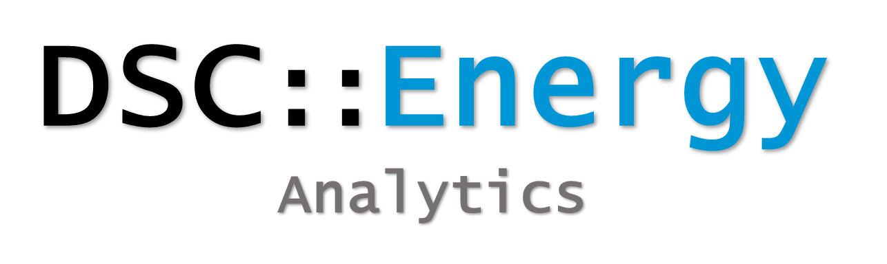

---
output:
  xaringan::moon_reader:
    css: [default, default-fonts, mytheme.css]
    lib_dir: libs
    nature:
      highlightStyle: github
      highlightLines: true
      countIncrementalSlides: false
---

background-image: url("logoSevillaR2.jpg")
background-size: 120px
background-position: 5% 5%

class: title-slide, center, middle

## Grupo de Usuarios de R de Sevilla

# IV Jacatón

### 

6 Abril 2019, 10 h

Sala TIC4, CRAI Reina Mercedes

http://bit.ly/SevillaRmeetup

